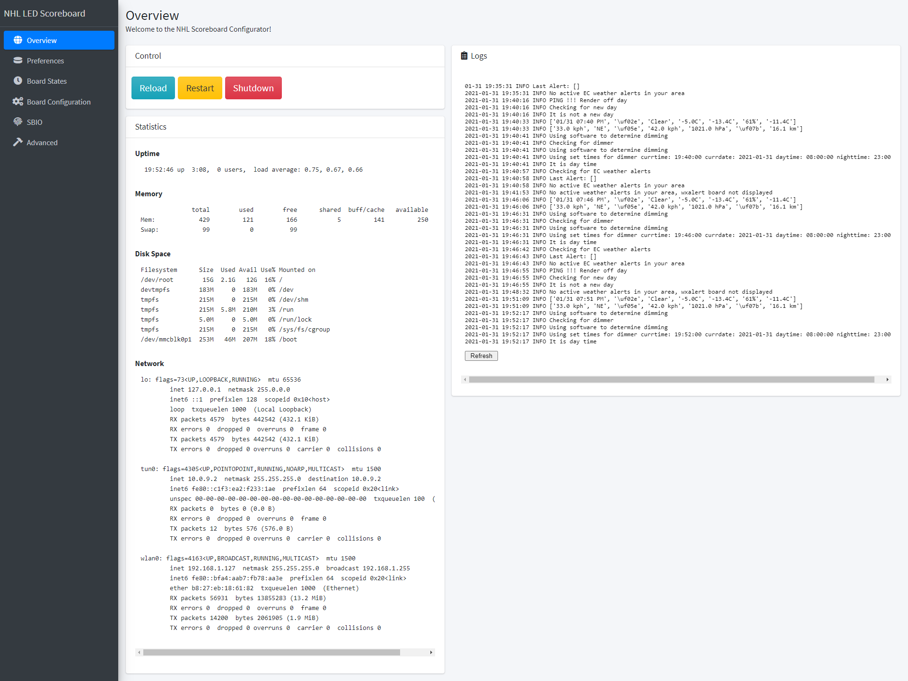
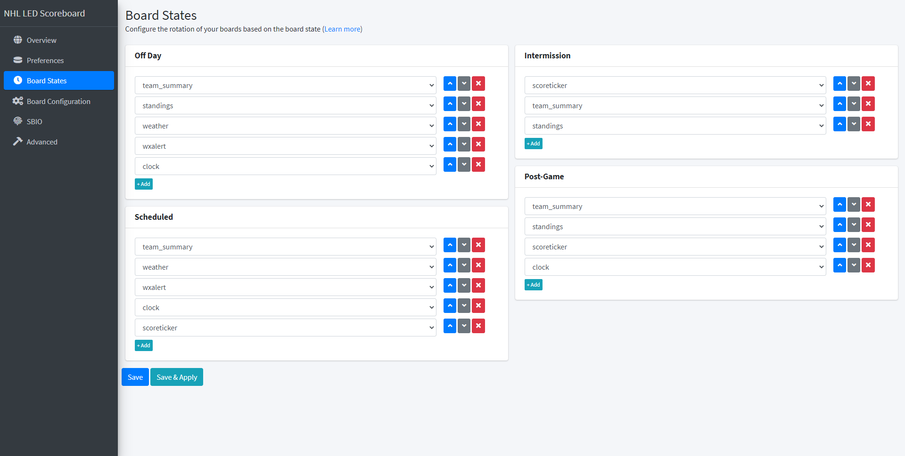
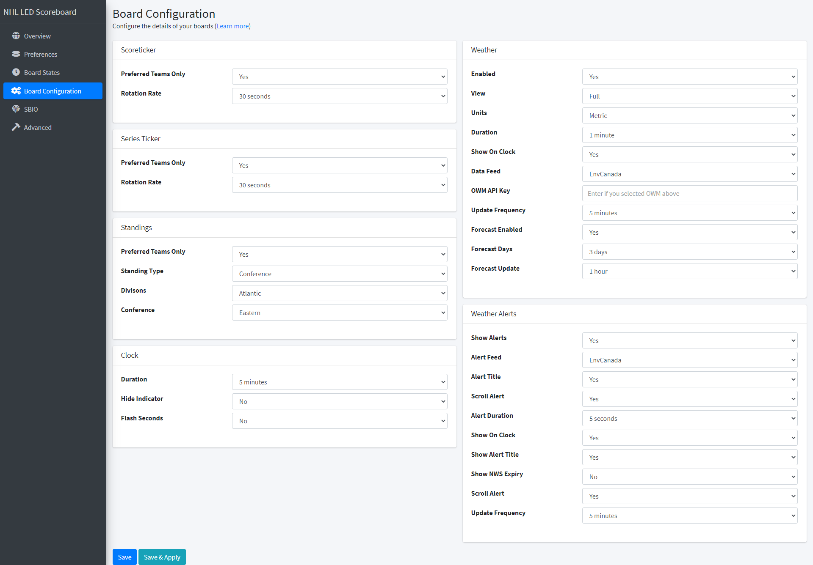
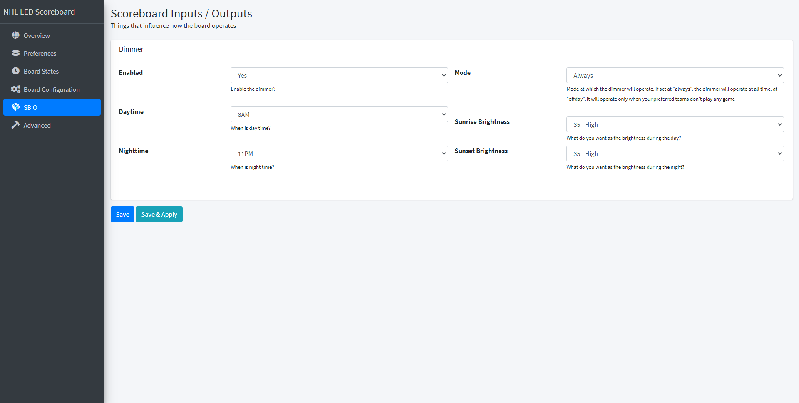
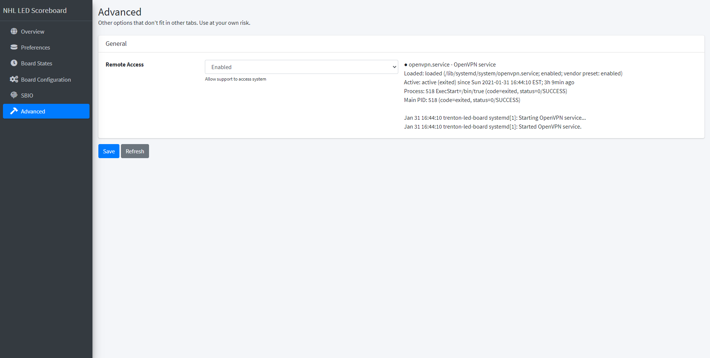

# NHL LED Web Configurator

This project is to make a web-based config panel for the NHL LED Scoreboard [found here](https://github.com/riffnshred/nhl-led-scoreboard).

## Why?

A few of my friends would like their own NHL LED Scoreboard, and they're not necessarily the most tech-savvy bunch. So now I can set them up with a board and away they go!

This is my first attempt at a python webapp, so let's see where I can take this!

## Screenshots

### Overview

### Preferences

### Board States

### Board Configuration

### Scoreboard IO

### Advanced

